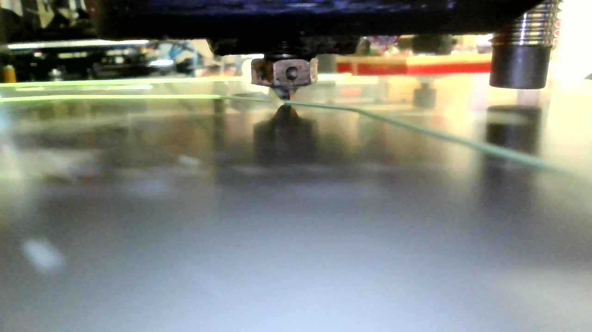

# 3D-Print-Extrusion-Classification
3D printing is a method for creating parts from any 3D geometry model and is generally prone to errors. A close-up camera positioned directly next to the printer nozzle can be used to see the majority of these mistakes. One particular error that occurs is known as extrusion, and the goal of this project is to identify if an extrusion has occurred through close up images. This project was done as part of a Kaggle competetion under the same name.

## Data
The dataset includes images from 7 different 3D printers. There are around 15 prints per 3D printer, each of which consists of a number of images taken in quick succession (every 0.5 seconds or so) from the nozzle camera. Every print is either an excellent print or is intended to be produced using extrusion. As a result, each label for a snapshot in a print will be the same.

Risk of Overfitting - Due to the small number of 3D printers in the dataset, it is easy to create an overfit ML model that performs well on images created by one of these printers but fails miserably when used to make predictions for printers that weren't included in the dataset. Even within the same printer, there is still the risk of overfitting: the model performs well for all the prints in the existing data set, but when a printer does a new print, the model will perform a lot worse.

## Domain Adaptation
Domain Adaptation is a method that tries to address this problem. Using domain adaptation, a model trained on one dataset does not need to be re-trained on a new dataset. Instead, the pre-trained model can be adjusted to give optimal performance on this new data. This is done by using a domain classifier which is a neural network that will be predicting which printer the output of the feature extractor is from. The intuition is that the feature extractor will try to perform some transformation on the input images such that the features appear as if it is coming from the same distribution and domain classifier will not be able to classify the domain of the transformed instances. This is achieved by training both the feature extractor and domain classifier in such a way that feature extractor will be trained to maximize the domain classification loss, while domain classifier will try to minimize the domain classification loss. So, this is similar to adversarial training wherein the feature extractor is trying to confuse domain classifier by bringing the two distributions closer. For the transformed source instances the label predictor will be trained for predicting the labels of the source instances. The feature extractor will therefore be trained to minimize classification loss of the label predictor and maximize classification loss of domain predictor.

For training the feature extractor in order to maximize the classification loss of domain predictor, Gradient Reversal layer was place between Feature extractor and domain classifier. The Gradient Reversal Layer basically acts as an identity function (outputs is same as input) during forward propagation but during back propagation it multiplies its input by -1. Intuitively, During back propagation the output of GRL is basically leading to the opposite of Gradient descent that is performing gradient ascent on the feature extractor with respect to the classification loss of Domain predictor.

## Model
The model I used was the ResNet, trying different architecture sizes and number of layers.
